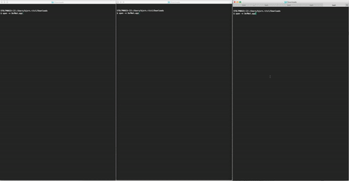

# Multiplayer example
This example shows how to create a local network multiplayer game. The example will listen for an instance of the application acting as a host or announce its presence as a host for other clients to connect to if no host is currently broadcasting on the local network.

When the host receives a connection its is forwarded to all the other clients. The clients themselves communicate directly with each other and repeatedly send a heartbeat message to the host. If a client is shut down or for some other reason is unable to send heartbeat messages it will be removed and the other clients will be notified.

### Discovery and broadcast
The discovery of a host and broadcasting when acting as a host is done through the [p2p_discovery module](https://github.com/britzl/defnet/blob/master/defnet/p2p_discovery.lua).

### Client to client and client to host communication
The communication between the clients and the clients and the host is done using the [udp module](https://github.com/britzl/defnet/blob/master/defnet/udp.lua).

The data sent between the clients is packed into a data stream, created using the [Trickle module](https://github.com/bjornbytes/trickle).

# How to run the example
The easiest way to test this is probably to bundle a desktop application and copy and run it on multiple computers, all connected to the same network.

If you don't have access to more than one computer then you can also start multiple instances on a single computers. On OSX you start multiple instances of an application like this:

	open -n /path/to/DefNet.app

IMPORTANT: Note that all clients have to be connected to the same network for them to find eachother.

# Future improvements
There are many many things to improve:

* Handle when the host disconnects. How to let one of the other clients act as host and take over broadcasting?
* Handle the extreme case when two clients have the same id
* Use [PlayFab](https://github.com/britzl/playfabexamples) or similar service for user authentication and use a PlayFab user id as client id when connecting.
* Use Photon Cloud or some other service to handle the matchmaking to allow for multiplayer games to be initiated over the internet and not limited to the local network.
* Improve the example game:
 * Animations (and let these reflect in connected clients)
 * An actual goal and some scoring

# Credits
Graphics by [Kenney](http://www.kenney.nl).
